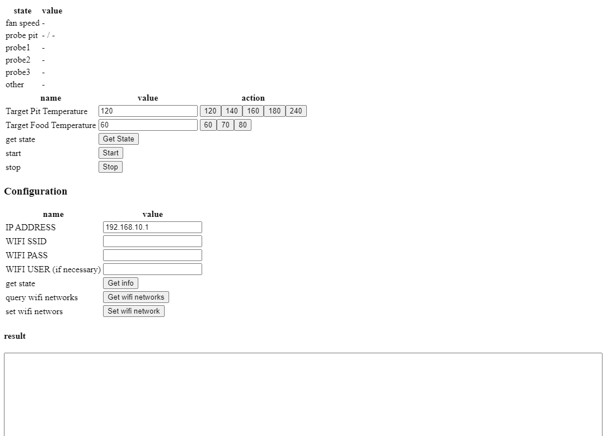

# ikamand

This app is a replacement for the iKamand application. The source code is based on MichalBelobrad's Python implementation, which can be found at https://github.com/MichalBelobrad/ikamand-http/tree/main.

This is my attempt to quickly resolve the issue of the missing iKamand cloud and the non-functional application.

## Usage

To use this app, follow these steps:

- Download the file ikamand-single.html to your phone.
- Connect your phone to the iKamand device using Wi-Fi Direct mode.
- Use the app to control your iKamand.

If your iKamand is still connected to a Wi-Fi network, you may be able to control it directly by setting the correct IP address (I haven't been able to test this).

## Notes

Please note that I am not an HTML frontend developer, so the code may not be as clean and organized as it should be. This was my attempt to quickly resolve the issue with the non-functional iKamand device in just a few hours.

## Issues

Currently there is a issue with CORS. For now, it's necessary to [install plugin](https://chrome.google.com/webstore/detail/cors-unblock/lfhmikememgdcahcdlaciloancbhjino) to disable cors check to be able to use it. I'm not sure if this can be solved by any other way than some proxy or own server.

## Known iKamand endpoints

- http://192.168.10.1/cgi-bin/info
- http://192.168.10.1/cgi-bin/data
- http://192.168.10.1/cgi-bin/cook
- http://192.168.10.1/cgi-bin/wifi_list
- POST http://192.168.10.1//cgi-bin/netset

### Data for netset (from decompiled apk):

`"http://192.168.10.1:80/cgi-bin/netset",6e4,{method:"POST",headers:s,body:"ssid="+n+"&pass="+a+"&user="+t}));`

### Complete communication dump for configuring wifi network

https://gist.github.com/pheller/2135a7e16c0380393076cf5535dd5f47?fbclid=IwAR145Js_WgWKxn8UNrfDaq3_ov5TcseWQCNBkf-jqB2MZoUPrf_6Txx7dno